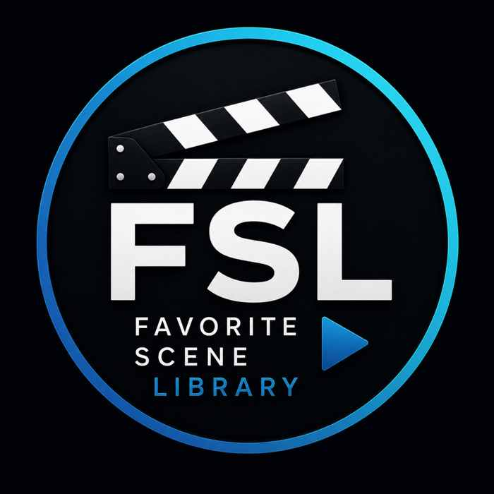
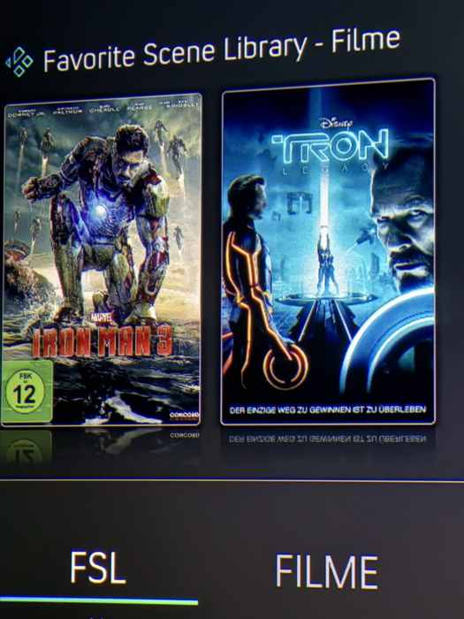
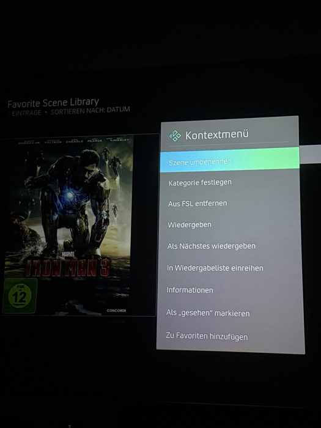
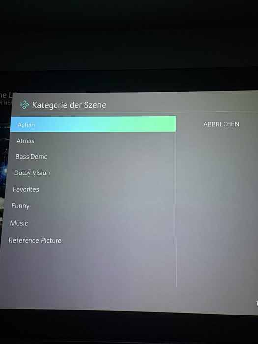
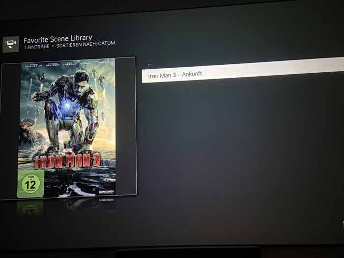
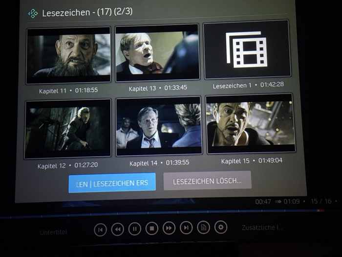

# Favorite Scene Library (FSL)

  

**A Kodi add-on for organizing and instantly playing favorite movie scenes.**  
**Ein Kodi-Add-on zum Organisieren und direkten Abspielen deiner Lieblingsfilmszenen.**

Developed by **Scourge** · Version **1.0.0** · German & English

  

---

## English

Favorite Scene Library turns Kodi video bookmarks into a separate, browsable scene library. Scenes can be renamed, grouped into categories and launched directly at their saved timestamp.

### Features

- Imports existing Kodi video bookmarks
- Starts playback at the exact saved timestamp
- Browse by movie, scene or category
- Rename scenes from the context menu
- Assign categories such as Atmos, Bass Demo or Dolby Vision
- Uses Kodi posters, fanart and available bookmark thumbnails
- Stores FSL names and categories in its own SQLite database
- German and English interface
- Works as a dedicated Kodi home-screen section with widgets

### Installation

1. Download `plugin.video.favoritescenelibrary-1.0.0.zip` from **Releases**.
2. In Kodi, open **Add-ons → Install from zip file**.
3. Select the downloaded ZIP file.
4. Open **Favorite Scene Library** under video add-ons.
5. Open **Synchronize Kodi Bookmarks** once.

### How to create and manage a scene

1. Start a movie in Kodi and pause at the beginning of the scene.
2. Display Kodi's playback controls.
3. Open **Bookmarks**. Depending on the skin, this is shown as a bookmark/page icon or under additional playback options.
4. Select **Create bookmark** or **New bookmark**. A normal scene bookmark is required; a resume point alone is not sufficient.
5. Open FSL. The bookmark is imported automatically or after **Synchronize Kodi Bookmarks**.
6. Open the scene's context menu to rename it, assign a category or remove it from FSL.
7. Selecting the scene opens the movie and seeks to the saved timestamp.

Removing a scene from FSL does **not** delete the original Kodi bookmark.

### Dedicated FSL home-screen entry and movie widget

For the cleanest setup, create a separate Kodi main-menu item named **FSL** and attach an FSL widget to it. The exact wording differs by skin, but the general procedure is:

1. Open the skin settings.
2. Go to **Home menu**, **Customize main menu** or a similarly named section.
3. Add a new main-menu entry and name it **FSL**.
4. Set its action to open the **Favorite Scene Library** add-on.
5. Add a widget to this menu entry.
6. Choose **Add-ons → Video add-ons → Favorite Scene Library → Movies** as the widget source.

Using **Movies** rather than **All Scenes** displays one poster per movie. Selecting a poster opens only the saved scenes for that movie. This remains clear even when the library contains many scenes.

Depending on the skin, the menu and widget settings may be called *Customize home menu*, *Widgets*, *Select widget*, *Choose path* or similar. The screenshots below show the setup in an Arctic-style Kodi skin.

### Screenshots

#### FSL main-menu entry with the Movies widget

#### Scene context menu

#### Assigning a category

#### Renamed scene in FSL

#### Kodi bookmark source

---

## Deutsch

Favorite Scene Library macht aus den in Kodi gespeicherten Video-Lesezeichen eine eigene, übersichtliche Szenenbibliothek. Szenen lassen sich umbenennen, Kategorien zuordnen und direkt an der gespeicherten Position starten.

### Funktionen

- Übernimmt vorhandene Kodi-Video-Lesezeichen
- Startet Filme exakt an der gespeicherten Position
- Ansichten nach Film, Szene und Kategorie
- Szenen über das Kontextmenü umbenennen
- Kategorien wie Atmos, Bass Demo oder Dolby Vision vergeben
- Verwendet Kodi-Poster, Fanart und vorhandene Lesezeichenbilder
- Speichert FSL-Namen und Kategorien in einer eigenen SQLite-Datenbank
- Deutsche und englische Benutzeroberfläche
- Als eigener Kodi-Startseitenpunkt mit Widget nutzbar

### Installation

1. `plugin.video.favoritescenelibrary-1.0.0.zip` unter **Releases** herunterladen.
2. In Kodi **Add-ons → Aus ZIP-Datei installieren** öffnen.
3. Die heruntergeladene ZIP-Datei auswählen.
4. **Favorite Scene Library** unter den Video-Add-ons öffnen.
5. Einmal **Kodi-Lesezeichen synchronisieren** ausführen.

### Szene anlegen und verwalten

1. Einen Film starten und am Anfang der gewünschten Szene pausieren.
2. Die Wiedergabesteuerung von Kodi einblenden.
3. **Lesezeichen** öffnen. Je nach Skin befindet sich die Funktion hinter einem Lesezeichen-/Seiten-Symbol oder in den weiteren Wiedergabeoptionen.
4. **Lesezeichen erstellen** oder **Neues Lesezeichen** auswählen. Es muss ein normales Szenen-Lesezeichen sein; ein bloßer Fortsetzungspunkt reicht nicht aus.
5. FSL öffnen. Das Lesezeichen wird automatisch oder nach **Kodi-Lesezeichen synchronisieren** übernommen.
6. Über das Kontextmenü kann die Szene umbenannt, einer Kategorie zugeordnet oder aus FSL entfernt werden.
7. Beim Öffnen der Szene startet der Film direkt an der gespeicherten Position.

Das Entfernen aus FSL löscht **nicht** das ursprüngliche Kodi-Lesezeichen.

### Eigener FSL-Startseitenpunkt mit Film-Widget

Für die übersichtlichste Bedienung sollte in Kodi ein eigener Hauptmenüpunkt **FSL** angelegt und mit einem FSL-Widget verbunden werden. Die Bezeichnungen unterscheiden sich je nach Skin, das Grundprinzip ist aber gleich:

1. Die Einstellungen des verwendeten Skins öffnen.
2. **Hauptmenü**, **Startmenü anpassen** oder einen ähnlich benannten Bereich öffnen.
3. Einen neuen Hauptmenüpunkt anlegen und **FSL** nennen.
4. Als Aktion das Add-on **Favorite Scene Library** auswählen.
5. Für diesen Menüpunkt ein Widget hinzufügen.
6. Als Widget-Pfad **Add-ons → Video-Add-ons → Favorite Scene Library → Filme** auswählen.

Als Widget sollte **Filme** und nicht **Alle Szenen** verwendet werden. Dadurch wird pro Film nur ein Poster angezeigt. Beim Anklicken des Posters erscheinen ausschließlich die gespeicherten Szenen dieses Films. Das bleibt auch bei vielen Szenen übersichtlich.

Je nach Skin heißen die Menüpunkte beispielsweise *Startmenü anpassen*, *Widgets*, *Widget auswählen* oder *Pfad wählen*. Die folgenden Bilder zeigen das Prinzip in einem Arctic-Kodi-Skin.

### Bildschirmfotos

#### Eigener FSL-Menüpunkt mit Filme-Widget

#### Kontextmenü einer Szene

#### Kategorie festlegen

#### Umbenannte Szene in FSL

#### Kodi-Lesezeichen als Grundlage

---

## License / Lizenz

MIT